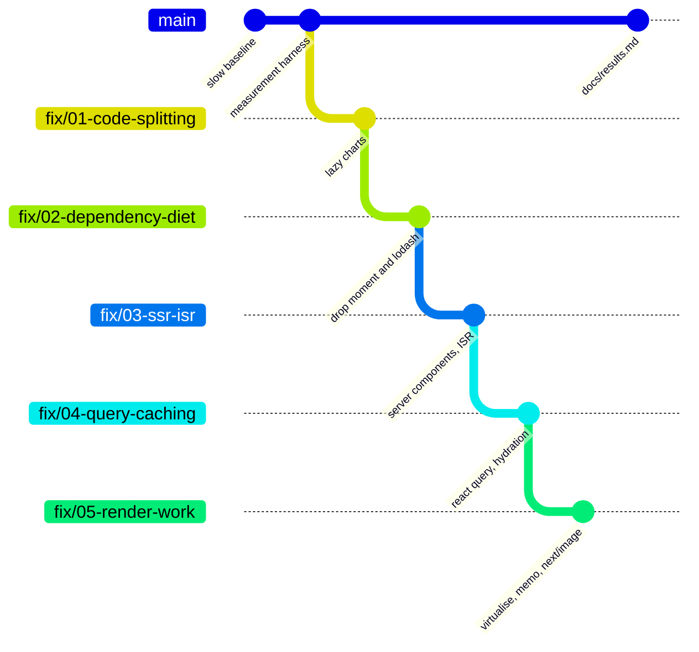

# react-performance-lab

[](https://github.com/mohadjillani/react-performance-lab/actions/workflows/ci.yml)
[](https://github.com/mohadjillani/react-performance-lab/actions/workflows/measure.yml)
[](https://github.com/mohadjillani/react-performance-lab/actions/workflows/compare.yml)
[](LICENSE)

**Five fixes, measured one at a time.** `main` is a deliberately slow Next.js course catalogue. Five branches each apply one class of performance fix on top of the previous one, and every branch is measured the same way — `size-limit` for bundles, Lighthouse CI for Core Web Vitals — by a script in this repository. The table is generated by that script, in GitHub Actions, not typed in.

<!-- results:start -->

_Not generated yet — run `npm run compare`._

<!-- results:end -->

## What is wrong with `main`

The slowness is intentional, seeded and documented, so the deltas are honest and repeatable. Each route carries one class of problem that shows up in real Next.js codebases:

| Route                | The problem                                                                                                                                                                                                  |
| -------------------- | ------------------------------------------------------------------------------------------------------------------------------------------------------------------------------------------------------------ |
| `/` landing          | `moment`, the whole of `lodash` and `recharts` imported at the top level of client components. First-load JS is 258 kB gzip, 150 kB of it for a chart and two formatting calls that are not needed to paint. |
| `/courses` catalogue | 2,000 rows, unpaginated, un-memoised, two `Intl` formatters and a `moment()` per row per render, thumbnails as `` with no dimensions. Every keystroke in the search box re-renders every row.           |
| `/courses/[slug]`    | Course → instructor → reviews fetched **in sequence** from a `useEffect`, so the page shows "Loading…" for three round trips after hydration. The rating chart pulls the chart library in here too.          |
| all three            | Every page is a client component that fetches on mount. The server sends an empty shell; nothing is rendered until JavaScript has downloaded, run and fetched.                                               |

Fixture data (2,000 courses, 200 instructors, 10,000 reviews) is generated from a fixed seed by `scripts/seed.ts` and committed, so every branch renders the same DOM and a test fails if the generator drifts from the file. Every read through `lib/data/store.ts` waits `LATENCY_MS` (default 150 ms) to stand in for a database. [`docs/profile-first.md`](docs/profile-first.md) walks through finding these problems with the bundle analyzer, the Network panel and the React Profiler before any fix is applied.

## The five fixes

Branches are cumulative — each is cut from the one before — because the fixes interact and the last branch should be the real end state ([ADR 001](docs/adr/001-cumulative-fix-branches.md)). Each row of the results table is therefore a delta against the row above it.



1. **Code splitting** — [`fix/01-code-splitting`](https://github.com/mohadjillani/react-performance-lab/compare/main...fix/01-code-splitting) · [notes](docs/fixes/01-code-splitting.md). The two charts move behind `next/dynamic` with a fixed-height placeholder. The chart library leaves the first-load bundle of both routes it was on; it is still downloaded, just not before first paint. "All client JS" barely moves, which is the point of measuring it separately.
2. **Dependency diet** — [`fix/02-dependency-diet`](https://github.com/mohadjillani/react-performance-lab/compare/main...fix/02-dependency-diet) · [notes](docs/fixes/02-dependency-diet.md). `moment` becomes `Intl.DateTimeFormat`; the four `lodash` helpers become `lodash-es` cherry-picks and array methods. Bytes are removed, not moved.
3. **SSR and ISR** — [`fix/03-ssr-isr`](https://github.com/mohadjillani/react-performance-lab/compare/main...fix/03-ssr-isr) · [notes](docs/fixes/03-ssr-isr.md). The three pages become server components with `revalidate = 60`; data is read on the server and the HTML arrives with content in it. Reviews stay a client fetch because they change often.
4. **Query caching** — [`fix/04-query-caching`](https://github.com/mohadjillani/react-performance-lab/compare/main...fix/04-query-caching) · [notes](docs/fixes/04-query-caching.md). TanStack Query with server-side prefetch and `HydrationBoundary`, so the remaining client fetch is answered from the cache on first render, plus hover prefetch from the catalogue and a `staleTime` that makes back-navigation instant.
5. **Render work** — [`fix/05-render-work`](https://github.com/mohadjillani/react-performance-lab/compare/main...fix/05-render-work) · [notes](docs/fixes/05-render-work.md). The catalogue is virtualised with `@tanstack/react-virtual`, rows are memoised, the search input uses `useDeferredValue`, formatters are created once, and thumbnails go through `next/image` with explicit dimensions.

Every branch passes the same Playwright suite ([`tests/smoke.spec.ts`](tests/smoke.spec.ts)): the same 2,000 courses, the same search results, the same detail page. A fix cannot improve a number by rendering less.

## Quick start

```sh
git clone https://github.com/mohadjillani/react-performance-lab
cd react-performance-lab
npm ci
npx playwright install chromium        # used by Lighthouse and by the parity suite

npm run dev                            # http://localhost:3000 — any branch
npm run build && npm run test:e2e      # behavioural parity against the production build
npm run measure                        # build + size-limit + Lighthouse -> .measurements/<branch>.json
```

`npm run measure` takes about four minutes on a laptop: one production build and nine Lighthouse runs (three per route). It exits non-zero when the checkout misses one of its own budgets, which is exactly what the `measure` workflow does on every push.

To reproduce the whole table:

```sh
npm run compare                        # every branch in scripts/branches.json -> docs/results.md
```

Expect two to four minutes per branch; the run is resumable (measured branches are skipped unless `--force` is passed). `LATENCY_MS=0` removes the simulated datastore latency if you want to see how much of the baseline's problem is round trips rather than bytes.

## How the numbers are produced

`scripts/measure.ts` is the only source of every number in this repository. It builds the checkout, copies each route's first-load JavaScript (taken from Next.js's build manifest) into a folder that `.size-limit.json` can gate, starts `next start` on a free port, warms each route once, runs Lighthouse three times per route under mobile emulation with simulated throttling, and writes the per-route medians to one JSON file. `scripts/compare.ts` runs it in a `git worktree` per branch and renders `docs/results.md`.

Budgets are per branch: `main` is gated against regressing further, and each fix tightens the budgets it improves by a documented tolerance (score −5, LCP/TBT +20 %, CLS +0.02, bytes +5–10 %). The full rules, the noise handling and why CI numbers are lower than a laptop's are in [`docs/methodology.md`](docs/methodology.md).

## The headline test

The measurement is the test. `measure.yml` fails any branch whose bundle or Lighthouse metrics miss its budget, and `compare.yml` regenerates the table from scratch on a schedule, which is the proof that the deltas are reproducible rather than a one-off. Behaviour is gated separately by `tests/smoke.spec.ts`, which runs unchanged on every branch. Unit tests (`npm test`) cover only what has to be exact: the fixture generator's determinism and drift, the Lighthouse median, and the table renderer. The React components themselves are deliberately not unit-tested — this repository is about measurement, and component tests would prove nothing about performance.

## Repository layout

```text
app/                    three routes and the /api route handlers (seeded data, LATENCY_MS)
components/             cards, rows, charts
lib/data/               seeded fixture generator, committed fixtures, the in-process store
lib/heavy/              moment and lodash wrappers — what main imports and fix/02 removes
scripts/measure.ts      build + size-limit + Lighthouse -> .measurements/<branch>.json
scripts/compare.ts      worktree per branch -> docs/results.md and the table above
scripts/branches.json   the branch list, in order
.size-limit.json        bundle budgets for this branch
.lighthouserc.js        Lighthouse budgets for this branch
tests/smoke.spec.ts     behavioural parity, run on every branch
docs/                   methodology, profile-first walkthrough, per-fix notes, ADRs, results
```

## Design decisions

1. [Cumulative fix branches rather than isolated ones](docs/adr/001-cumulative-fix-branches.md) — fixes interact; the last column should be the real application.
2. [Lighthouse CI in GitHub Actions with median-of-three](docs/adr/002-lighthouse-ci-median-of-three.md) — reproducibility over precision; anyone can re-run a workflow, nobody can re-run a laptop.
3. [size-limit as the gate, the bundle analyzer as the diagnostic](docs/adr/003-size-limit-gate-analyzer-diagnostic.md) — one fails the build, the other tells you what to cut.

Why Next.js and not a Vite SPA: rendering strategy is one of the five fixes, and a SPA cannot demonstrate it. Why keep the slow app on `main`: the first thing a visitor should be able to clone and profile is the problem.

## Limits

- **Lab data.** One throttling profile, no field data, no real users. The absolute numbers are not a prediction of anything; the deltas down a column are the result.
- **CI runners are noisy.** Median-of-three and the budget tolerance make the gate stable, not exact. A metric near its budget can fail on a slow runner; re-run it.
- **Deltas depend on the order.** Splitting a dependency before removing it makes fix/01's delta larger and fix/02's smaller than the other way round. The order is the order a rebuild would follow; it is not the only one.
- **Cold loads only.** The gains from client-side caching show up in navigations, which Lighthouse does not measure; the table reports API request counts during load as a proxy.
- **One dataset size.** 2,000 rows makes the catalogue's problems visible without making the baseline unusable. The virtualisation delta grows with row count; the code-splitting delta does not.

## License

MIT © Mohad Jillani
