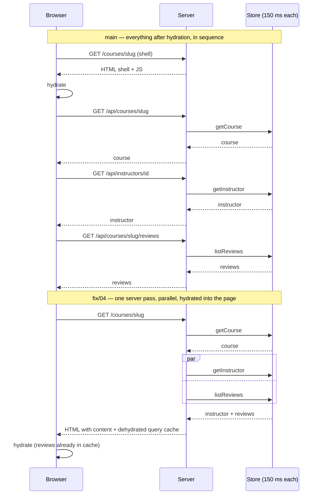

# Fix 04: query caching

**Branch:** [`fix/04-query-caching`](https://github.com/mohadjillani/react-performance-lab/tree/fix/04-query-caching) · [diff against `fix/03`](https://github.com/mohadjillani/react-performance-lab/compare/fix/03-ssr-isr...fix/04-query-caching) · cut from `fix/03-ssr-isr`

## Symptom

After fix/03 the detail page still makes one request during load — the reviews — and the server still reads the course, then the instructor, then nothing else; the reviews fetch cannot start until the client has hydrated the `Reviews` island. Navigating catalogue → detail → back → another detail refetches everything each time, because nothing on the client remembers anything.

## Evidence

The "API requests" column for the detail page reads `1` on `fix/03`. In the Network panel the reviews request starts after hydration, roughly where the whole chain used to start on `main`:

## Change

TanStack Query, scoped to the `/courses` segment (`app/courses/layout.tsx`) so the landing page does not pay for the client.

1. **Server prefetch and hydration.** The detail page creates a `QueryClient`, reads the instructor and the reviews **in parallel** (`Promise.all`), and dehydrates the cache into a `HydrationBoundary` around the `Reviews` island. `Reviews` calls `useQuery(reviewsQuery(slug))` and gets data on its first render; the query function in `lib/queries.ts` only runs when nothing has filled the cache.
2. **Hover prefetch.** `CourseRow` warms the reviews query on `mouseenter` / `focus`. A click that follows finds the cache filled, and the reviews island renders without a request or a loading state.
3. **`staleTime` = the ISR window (60 s).** Anything the server rendered or the client prefetched is trusted for a minute, so back/forward navigation within that window never refetches. The two caches agree on what "fresh" means.

The same `reviewsQuery` object is the key for all three, which is what keeps them consistent: one definition of the key and the fetcher, three consumers.

## Measured delta

| Metric                           | `fix/03` | `fix/04` | Delta |
| -------------------------------- | -------: | -------: | ----: |
| Detail: API requests during load |        1 |        0 |    −1 |
| Detail: performance              |       97 |       99 |    +2 |
| Detail: LCP                      |   2.48 s |   2.05 s | −17 % |
| Detail: TBT                      |    81 ms |    55 ms | −32 % |
| Course detail first-load JS      | 108.2 kB | 120.7 kB | +12 % |
| All client JS                    | 356.4 kB | 371.7 kB |  +4 % |
| Catalogue first-load JS          | 107.3 kB | 107.6 kB |    ±0 |
| Landing: LCP                     |   2.57 s |   1.81 s | noise |

The landing page is not touched by this branch; its LCP moved by more than the detail page's did, which is a useful reminder of the run-to-run variance behind every Lighthouse number here (see [methodology](../methodology.md#noise)). The detail bundle grows by the query client and the hydration code; the budget for it was raised from 114 to 127 kB on this branch.

Local run, Apple Silicon, 8 GB, Node 23. Lighthouse measures a cold load, and on a cold load the visible change is the last API request leaving the load path. The cost is the query client itself in the first-load bundle of the two `/courses` routes. The win this branch is really about — navigation without refetching — is not something Lighthouse scores; the Network panel and the parity suite's catalogue → detail step are where it shows.

## When not to do this

- **When the data is already in the page and nothing else needs it.** Hydrating a query cache for data a server component could simply render as props adds a client library for no benefit. Reviews are cached here because they are _also_ fetched on navigation and refreshed on focus; that is what the cache is for.
- **When `staleTime` and the server cache disagree.** A 60 s ISR page with a 0 s `staleTime` refetches everything on mount, which is the waterfall back with extra steps. Choose the client's freshness window from the server's, not by default.
- **Hover prefetch on a list that is mostly not clicked.** Each `mouseenter` is a request; on a dense list a user scanning with the mouse can trigger dozens. It pays when the click rate is high or the request is cheap; otherwise prefetch on `mousedown`, or not at all.
- **Instead of fixing the API shape.** The parallel read on the server works because the instructor and the reviews both depend only on the course. If a real API returned a course with its instructor embedded, there would be nothing to parallelise; that change is cheaper than a caching layer and should be tried first.
